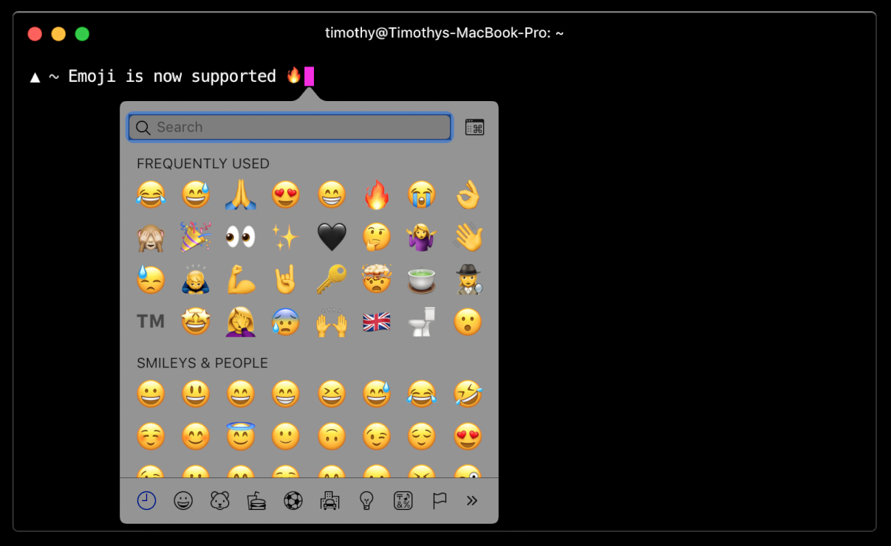

import DownloadButton from '../DownloadButton.js'
import BatchingImage from '../../static/batching.svg'

# Hyper 3

**Hyper 3 is finally out!** and the main theme for this release is:
**performance**. To try it out, download it below. Read on to learn what's in
this release and how it was developed.

  <DownloadButton />
  

We've included a bunch of big and small improvements to make Hyper 3 very fast.
For all of us that spend a significant amount of time on the command line, this
release is a game changer.

    
Hyper v2

    
Hyper v3

<video
    id="vid"
    src="static/v2-vs-v3.mp4"
    width="100%"
    autoPlay
    loop
    muted
    />

## Getting There

An interesting thing about this release is that it took a relatively short time
from "let's make it faster" to "Holy shell! that's pretty fast!". The most
important tool we used to keep this process efficient was the DevTools profiler,
perks of building on a web platform, tools are really good. 

We continuously captured CPU profiles to find bottlenecks, and focused only on
those issues.  Let's take a tour around the changes we made to make Hyper 3 one
of the fastest terminals out there.

### WebGL Renderer

The first bottleneck we found was the renderer. This is the piece of code that
takes the state of the terminal and draws the actual pixels to the screen. The
original Hyper renderer used the DOM, this was flexible (hello CSS) but slow.
Hyper 2 improved upon this by switching from hterm to xterm.js and its
canvas-based renderer, which was way faster. For Hyper 3, we knew it was
possible to make it faster by rewriting the renderer using
[WebGL](https://developer.mozilla.org/en-US/docs/Web/API/WebGL_API).

By a fortunate coincidence, as we were figuring out how to build such a thing,
[@Tyriar](https://github.com/tyriar) (from xterm.js and VSCode), [was coming back from a "vacation" where he
happened to be writing a shinny new WebGL
renderer](https://twitter.com/Tyriar/status/1064932797016489984)! (open source
is amazing ❤). We promptly merged @Tyriar's branch onto a test fork, and well,
it ran circles around Hyper 2. Thanks @Tyriar.

At the moment, there are a few minor limitations with this renderer (i.e.
selection is always black-and-white, and you can't have more than 16 terminals
visible simultaneously) but we think the performance benefits vastly outweight
these.

The new renderer is still considered work-in-progress so expect more
improvements in the near future.

### IPC Batching

Another performance issue we noticed was that very verbose commands would cause
Hyper to choke for a few seconds, and then suddenly speed up again. For example,
running `find ~` would cause Hyper to:

- Run painfully slow for ~5 seconds (at ~1 frame-per-second)
- Suddenly get faster (at ~15 frames-per-second) and finish printing everything in ~10 seconds.

Digging into the CPU profiles, we noticed that the "renderer" process was
spending most of its time handling an overwhelming amount of messages coming
from the main process.

In these profiles, it's easy to see the difference between v2 and v3.

 <BatchingImage /> 

The pink segments represents the time spent processing IPC, instead of parsing
or rendering.

Electron, being based on Chromium, uses a multi-process architecture where each
window runs on its own separate process called a "renderer" process.
Additionally, there's one Node.js-based "main" process that talks directly to
the underlying OS. In order for terminal data to be rendered by Hyper, it must
be passed from the main process to the renderer process using IPC (Inter-Process
Communication).

**Node's IPC, unfortunately, comes with a non-trivial amount of overhead.**
Messages are sent back and forth as **JSON strings** which must be encoded on
one side and decoded on the other. Not only that, receiving data through IPC is
an async operation and thus queued in v8's event loop. Yielding back the to the
event loop every time we're done processing one of these small messages was, of
course, making things worse overall. This repeated IPC caused thrashing when
many small messages were passed in a short period of time (see upper profile
above)

We mitigated this problem with a simple solution: batch data into larger chunks
before sending them to the renderer process. IPC batching reduces the number of
messages for verbose commands significantly and allows the renderer to focus on,
well, rendering.

One important consideration was to **batch as much data to reduce the IPC
overhead, but not too much as to introduce perceivable latency**.

With this approach, the renderer process now spends most of its time doing
terminal emulation and rendering, as opposed to processing a fire hose of IPC
messages. The result is a smoother and faster terminal.

On a similar vein, we're also testing a new approach to [deciding how much data
is parsed](https://github.com/zeit/xterm.js/pull/4/files) before yielding to the
renderer. The idea is to prevent skipped frames for a more responsive terminal.

### Electron v3

Hyper 3 bumps the version of the underlying Electron from v1 to v3. We also
tested Electron v4 (the latest and greatest) but a [regression in the Canvas
API](https://bugs.chromium.org/p/chromium/issues/detail?id=683994#c35) forced us
to stay on v3. This version brings along newer versions of V8 and Node.js and
their corresponding bug fixes. We were hoping to see additional performance
improvements simply by upgrading Electron (given that v8 is beign continuosly
improved) but no luck there. At least not that we could measure with our
benchmarks. 

### Faster Startup Time

Hyper 3 improves startup time by creating the first pseudo terminal (pty) as
soon as possible. A pty is a facility that OSs provide to allow programs, such as
Hyper, to emulate terminals.

In previous versions, Hyper would wait for the Chromium window to open, wait for
the window to send an "I'm ready" message, and *then* create the pty.

Turns out that these two things (creating the window and creating the pty) take
a substantial amount of time but can be done in parallel. Hyper 3 starts
initializing both at the same time, so when the window says "I'm ready", the pty
is warmed-up and ready to be consumed. Giving us a decent boost in launch time
of about 150ms (on Linux, potentially higher gains on other platforms)

### Emoji Support

If you're on MacOS, you can now press `  Command + Control + Space  ` to get the
emoji popup and [jazz up those commit
messages](https://gitmoji.carloscuesta.me/), or anything else really, we ❤
emoji.

  

    
  

  

## Road Ahead 

Terminals are one of those tools that have existed since the 60s (we're
literally emulating [this machine](https://en.wikipedia.org/wiki/VT100)!) but
it's power and flexibility guarantees that will remain relevant for years to
come, so [we're in for the long
haul](https://twitter.com/rauchg/status/1074381303506587650).

Hyper is a new kind of terminal built on top of web technology with a focus on
extensibility. This opens new possibilities that can make the CLI experience
[more productive](https://github.com/chabou/hyper-pane), or simply [more
fun](https://github.com/Aaronius/hyper-cat).

We're excited to keep improving Hyper both in terms of performance and
capabilities. There's a lot to do. Feel free to [swing
by](https://github.com/zeit/hyper) and contribute to the future.

## Acknowledgements

I'd like to point out how amazing the open source community can be, not only the
fact that we're building on top of the awesome set of open source libraries
(e.g. xterm.js, electron, etc), but also because as soon as the xterm.js folks
heard we were working on performance, they jumped right in and helped us with
feedback and a bunch of initiatives they have on their side. Expect many more
improvements. Huge thanks to [@Tyriar](https://github.com/tyriar), 
[@Jerch](https://github.com/jerch), and
[@Stanzilla](https://github.com/stanzilla) for their contributions and feedback.
